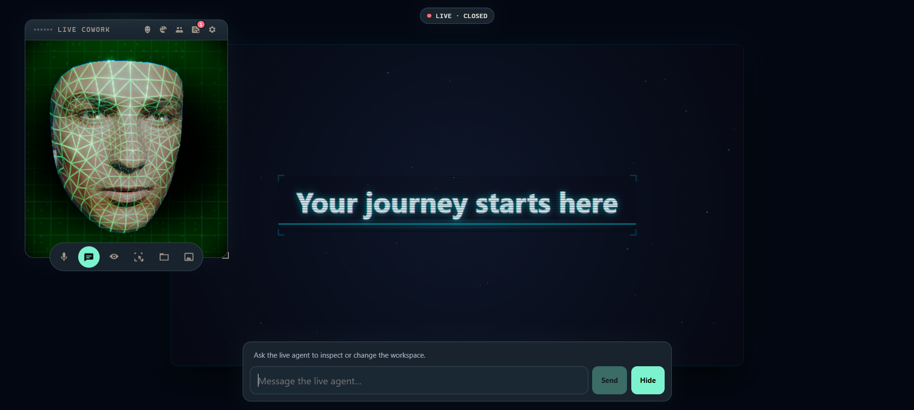

# Minimal Gemini Cowork

A full-screen cowork workspace with a movable talking wireframe head, Gemini Live voice and vision, photo-based face skinning, and durable concurrent planning/coding orchestration.



## Requirements

- Node.js 24 or newer
- Docker Desktop (running)
- Chrome or Edge with WebGPU enabled for the rendered head
- A Gemini API key
- Git and FFmpeg available on `PATH` (or set `FFMPEG_PATH`)

Docker is used only for generated-workspace commands and previews. The cowork shell and Gemini integrations run directly on the host. This gives generated code a workspace-only mount, network isolation during commands, and CPU/memory/process limits. If Docker is unavailable, the last static preview can still be displayed, but coding tasks cannot run safely.

At startup, the server builds a cached `cowork-sandbox:local` image for coding commands. It provides Node.js, npm, and the `file` utility; Python is intentionally unavailable. Ordinary commands remain network-isolated, while dependency installation receives temporary registry access.

## Setup

```powershell
Copy-Item .env.example .env
# Add GEMINI_API_KEY to .env
npm install
npm run dev
```

Open `http://127.0.0.1:5173` in development. For a production build:

```powershell
npm run build
npm start
```

Then open `http://127.0.0.1:3301`.

## Using the workspace

- Drag the head panel by its top bar and resize it from its lower-right corner.
- Use the microphone button to connect or mute Gemini Live.
- Use the chat button to slide the text input on or off screen.
- Use the vision button and select the current tab to stream the rendered workspace to Gemini Live at a low frame rate.
- Use the selection button, then click any rendered workspace element. Its unique selector, authored ID, text, attributes, bounds, and nearby DOM are automatically attached to the next coding request.
- The Live agent can query that selected DOM context directly and can capture a tightly cropped image of the selected element when visual details matter.
- Use the face button to open Assistant Settings. Upload a private portrait, blend wire to skin, choose hologram colors, animated digital backgrounds, particles, and post-processing effects, and configure the Live agent's personality and Gemini voice.
- Use the folder button to browse every generated-project file, edit text, preview images/audio/video, and select files as agent context.
- Use the palette button in the assistant title bar to switch between the built-in Dark and Light themes or create a global custom UI theme with coordinated surfaces, accessible text colors, accents, sizing, shadows, glow, blur, and lighting.
- Use the gear in the top-right of the assistant panel to configure DOM, Canvas, or Mixed workspace behavior, live-vision sampling, agent permissions, and validation speed. Workspace and assistant settings persist beneath ignored `.cowork` state.
- Use the activity icon beside the gear to inspect persistent Live, direct-edit, planning, coding, HTTP, preview, and system logs. The Activity Center can reconnect Live, stop an active agent, restart the preview, restore the active release, or back up the draft and roll back to an earlier immutable release.
- The Workspaces section in that panel can create a mode-specific project, open another saved workspace, duplicate any workspace, rename it, or permanently delete an inactive workspace. Every validated change is saved automatically; switching does not create a Git commit.
- Drag images or media over the rendered workspace to import them. MP3 and other supported audio files are stored directly under `uploads/`; common raster formats—including AVIF, HEIC/HEIF, TIFF, BMP, JPEG XL, and ICO—are normalized to WebP under `uploads/images/`. Workspace Files opens and focuses the import only when it was closed. Drop images on the Image Editor to add layers, or drop media on a Workspace Files folder to save it there without changing the current view.
- Ask the Live agent for a complex feature, architectural change, migration, redesign, or uncertain debugging task and it will start a read-only Planning Agent. The generated Markdown plan is stored under `plans/` and opened in Workspace Files for review.
- Edit the plan and select Proceed, or tell the Live agent to execute the plan by path. The Coding Agent turns approved plan steps into a visible todo list and updates it while it works.
- Each planning segment may use up to 80 model interactions. If that limit is reached or the model request times out, the same run pauses with its Gemini interaction chain preserved; continue or stop it from the agent terminal, or answer the Live agent's prompt.
- Focused, decision-complete changes can still go directly to the Coding Agent. Agent starts are asynchronous, so Live voice/chat and read-only status queries remain available while work runs.
- The live agent can list, search, read, and atomically edit workspace files directly. The coding agent can generate reference-guided images and four-second, position-anchored animated WebPs through Veo image-to-video, use explicit first and last frames for controlled transitions or seamless loops, remove flat-color backgrounds from existing images, and split sprite or symbol sheets into separate transparent assets.
- Other workspaces remain isolated. If the current request explicitly names one—such as “import my logo from Marketing workspace”—the agents receive request-scoped, read-only list/search/read access and may copy a requested file into the active workspace.
- The live agent can optionally attach a current workspace image when a visual or layout request needs it. Simple text edits stay text-only for speed.
- While work is running, select the task indicator to open the agent terminal. Coding runs show completed/total progress and a persistent todo checklist above the activity log.
- Delegated work is durably queued and coordinated by a hidden Assistant layer while the Live agent remains available for conversation. Exact and semantic duplicates are coalesced, and queued or running work can be updated or cancelled by task ID.
- Up to three agents run concurrently by default (configurable from one to eight). Coding agents work on isolated Git branches/worktrees; validated results are integrated serially and committed to `main` as one auditable task commit. Existing dirty workspace changes are checkpointed separately.
- Planning is read-only and does not lock workspace mutations. The coordinator automatically continues up to three planning segments before requesting confirmation.
- Select the work indicator to open the task-centric Work Center, which shows queued work, active planners/coders/media jobs, attempt timelines, approval requests, conflicts, retries, commits, and terminal results.
- Refreshing the page reconnects to the active agent and restores its terminal history and todos. A completed plan awaiting approval reopens in Workspace Files.

## Architecture

- `src/client/avatar` wraps the face renderer, animation, lip sync, and photo mapper adapted from the original `face` project.
- `src/client/live` handles microphone PCM, Gemini Live messages, workspace vision frames, captions, and delegated tool calls.
- `src/server/live` keeps the API key server-side and proxies the Gemini Live WebSocket.
- `src/server/orchestration` owns the SQLite work ledger, hidden Assistant routing, duplicate/update/cancellation state machine, concurrent worker pool, Git worktrees, validated integration, and completion notices.
- `src/server/agent` owns the read-only planner, coding model loops, visible todos, and compatibility adapters for the original task/plan endpoints.
- `src/server/workspace` exposes a small allowlisted tool surface and manages Docker execution, browser inspection, immutable releases, rollback, and preview routing.
- Media generation stores organized WebPs under `assets/generated`, asks for a uniform green stage, samples the actual returned stage color, chroma-keys retained frames, and records metadata in a manifest.
- Deterministic image processing stores lossless WebPs under `assets/processed`; it remains available when generative media is disabled and does not send source images to a model.
- Each workspace has an independent draft, immutable release history, settings file, generated-media state, and bare Git repository. Changes made in Workspace Files are committed automatically with messages compiled from the user's create, update, rename, copy, upload, and delete actions.
- DOM and Mixed modes stream the composited preview page. Canvas mode restricts vision to one `data-cowork-canvas-primary` element and requires `window.coworkCanvas` to expose `getPrimaryCanvas`, `hitTest`, and `getLayer` for semantic layer selection.
- Workspace drafts and releases live beneath ignored `workspace/projects/<workspace-id>/`; per-workspace Git and state live beneath `.cowork/workspaces/<workspace-id>/`. Existing singleton data is copied into `Workspace 1` during the one-time migration.

The coding agent cannot access the cowork application source, `.env`, host filesystem, or Docker socket through its tools. Normal commands run without network access; dependency installation receives temporary registry access. Failed validation triggers up to three automatic repair passes, and unsuccessful drafts are preserved separately while the visible release remains unchanged.

Agent and media configuration can be overridden with `GEMINI_PLANNER_MODEL`, `GEMINI_IMAGE_MODEL`, `GEMINI_VIDEO_MODEL`, `FFMPEG_PATH`, and `MEDIA_GENERATION_TIMEOUT_MS`. The planner model defaults to `GEMINI_CODER_MODEL`. Veo reference-image and image-to-video requests are generated at eight seconds because of the API constraint, then converted to a four-second, 12 FPS animated WebP. First/last-frame requests retain the complete generated transition while condensing it to four seconds. Temporary source video and frames remain under ignored `.cowork/media-jobs` storage only for the duration of the job.

## Checks

```powershell
npm run typecheck
npm test
npm run build
```
