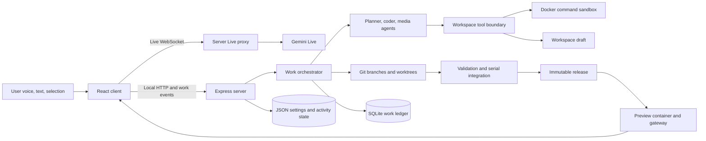

# Architecture

## Purpose

Explain Talking Assistant's runtime boundaries, durable work flow, workspace lifecycle, persistence, Git integration, and sandbox model.

## Use this guide when

- You need to trace a request across client and server.
- You are changing workspace, orchestration, persistence, preview, or sandbox code.
- You are diagnosing where durable state or generated files live.

## System boundaries

| Boundary | Responsibility |
| --- | --- |
| React client (`src/client`) | Shell UI, microphone, frame capture, selections, settings, file/media panels, activity and work subscriptions |
| Express/WebSocket server (`src/server`) | API key custody, Live proxy, local APIs, orchestration, workspace mutation, media jobs, preview gateway |
| Generated workspace | User project draft, releases, assets, uploads, plans, and project-local dependencies |
| Docker command sandbox | Workspace-scoped commands with resource limits and controlled networking |
| Docker preview container | Builds and serves a generated release for loopback browser inspection and display |
| External model services | Gemini Live, planning/coding models, and configured media models |

No runtime API or package identifier is renamed by the Talking Assistant documentation brand.

## Data flow

## Live proxy and client surfaces

The client sends microphone audio, tool responses, and optional workspace frames through `/api/live`. [`LiveProxy.ts`](../src/server/live/LiveProxy.ts) opens the upstream Gemini Live session so `GEMINI_API_KEY` never needs to enter browser code. Separate WebSockets stream activity and durable work events.

The preview gateway injects the selection bridge into rendered HTML. DOM and Mixed modes expose the whole composited page to vision; Canvas mode restricts capture to the primary canvas and depends on semantic canvas adapter methods.

## Work orchestration

[`WorkStore.ts`](../src/server/orchestration/WorkStore.ts) stores work snapshots, append-only events, and idempotent operation results in SQLite with WAL mode. Requests have normalized fingerprints for duplicate detection. The orchestrator routes queued work, records attempts, handles questions and plan approval, and returns interrupted runs to the queue on startup.

Focused Live edits bypass the durable worker pool but still pass through workspace change services, mutation locking, publication, and Git recording. Durable coding runs use the concurrent runner; planning is read-only and does not acquire the workspace mutation lock for its model loop.

## Workspace lifecycle and Git

Each workspace receives its own draft and state directories. Coding attempts branch from workspace `main` into isolated Git worktrees. Before branching or integration, dirty draft changes are checkpointed. Integration is serialized per workspace, merges the worker commit into a temporary integration worktree, validates it, creates one task commit, advances `main` atomically, resets the draft to that commit, and publishes it.

If a merge conflicts, validation fails, or publication fails, the visible release is not advanced. Failed or recovery drafts are retained separately. Immutable releases can be reactivated, and the current draft can be restored from the active release.

## Persistence paths

Paths are relative to the repository root unless noted.

| Path | Contents |
| --- | --- |
| `workspace/projects/<workspace-id>/draft/` | Active editable generated project |
| `workspace/projects/<workspace-id>/releases/` | Immutable published project snapshots |
| `workspace/projects/<workspace-id>/failed/` | Failed attempts and recovery backups |
| `.cowork/workspaces.json` | Workspace catalog and active workspace |
| `.cowork/workspaces/<workspace-id>/` | Workspace Git repository, settings, worktrees, and workspace state |
| `.cowork/orchestration.sqlite` | Durable work snapshots, events, and idempotent operation results |
| `.cowork/agents/config.json` | Agent profiles, routing, contexts, skills, and secret metadata/grants |
| `.cowork/workspaces/<workspace-id>/media-jobs/` | Workspace media-job state and temporary artifacts |
| `.cowork/media-jobs/` | Assistant portrait-processing temporary state and legacy-compatible media state |
| Generated project `plans/` | Reviewable Markdown implementation plans |
| Generated project `assets/generated/` | Saved generative media outputs |
| Generated project `assets/processed/` | Deterministically processed raster outputs |

Legacy singleton workspace data is migrated into the multi-workspace layout during registry initialization. Treat exact migration rules as implementation details and verify them in the registry before modifying storage.

## Sandbox and trust boundaries

Generated-project commands are executed by the host server through the cached `cowork-sandbox:local` Docker image. The project root is mounted at `/workspace`, and each disposable container receives two CPUs, 2 GB memory, and a 256-process limit. Ordinary commands use `--network none`. Dependency installation uses bridge networking temporarily so package registries are reachable. The minimal Alpine image includes Node.js, npm, and the `file` utility; Python is intentionally absent. The current Docker invocation does not add a read-only root filesystem, a non-root user, dropped capabilities, or `no-new-privileges`; treat those as potential hardening work, not current guarantees.

Preview containers are a separate boundary. They use bridge networking, two CPUs, 2 GB memory, a 256-process limit, and an ephemeral container port bound to `127.0.0.1`. Browser inspection checks console/page errors before publication in standard validation.

Non-negotiable boundaries:

- Workspace agent paths must remain rooted within the active generated workspace or an explicit read-only reference grant.
- Agent tools must not expose the application source tree, host `.env`, arbitrary host files, or the Docker socket.
- Ordinary workspace commands must remain network-isolated; only the dedicated dependency-install path may receive temporary network access.
- The server-side API key must not be sent to browser code or generated workspaces.
- A failed validation or integration must not replace the active visible release.

This remains a local, single-user security model. The local API is unauthenticated, the host server can invoke Docker and write repository-local state, and model providers receive content supplied to their APIs. Do not expose the service directly to untrusted networks.

## Source of truth

- Server composition and routes: [`src/server/index.ts`](../src/server/index.ts)
- Runtime paths and limits: [`config.ts`](../src/server/config.ts), [`WorkspaceManager.ts`](../src/server/workspace/WorkspaceManager.ts)
- Workspace catalog: [`WorkspaceRegistry.ts`](../src/server/workspace/WorkspaceRegistry.ts)
- Durable work: [`src/server/orchestration`](../src/server/orchestration)
- Sandbox image: [`sandbox.Dockerfile`](../docker/sandbox.Dockerfile)
- Shared contracts: [`protocol.ts`](../src/shared/protocol.ts)

## Related documentation

- [Documentation index](README.md)
- [Project overview](../README.md)
- [Capabilities](capabilities.md)
- [Agent system](agent-system.md)
- [Development](development.md)
